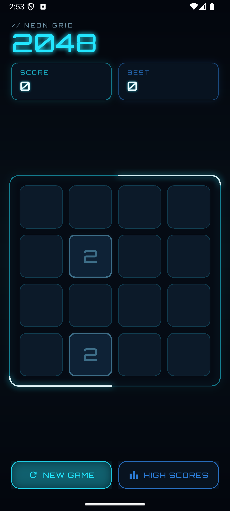
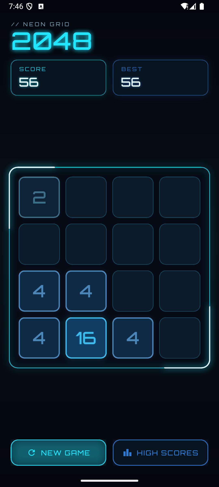
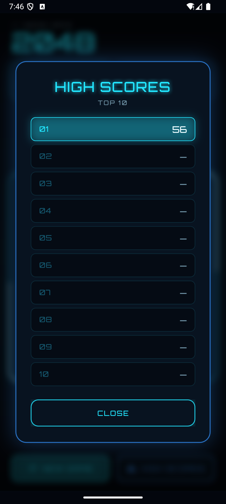

# Neon 2048

A neon-styled 2048 clone for Android, written in Flutter. Single screen, swipe
to play, tiles glow brighter the bigger they get, top 10 high scores kept on
device.

<p align="center">
  
</p>

## Screenshots

| Home | Gameplay | High scores |
|---|---|---|
|  |  |  |

## Features

- Classic 4×4 2048 mechanics — slide, merge, double.
- Swipe gestures (and arrow keys on hardware keyboards) for input.
- Animated tile slides, merge pops, and spawn appearances.
- A breathing neon frame with two light streaks orbiting the perimeter.
- Per-value tile palette — a dim slate-blue 2 climbing to a white-hot 2048.
- Live `SCORE` and `BEST` panels, with the best loaded from device storage.
- Top 10 high scores persisted via `shared_preferences`. The current run is
  banked on game over or whenever you start a new one.
- Game-over (`GRID LOCKED`) and win (`2048 SYSTEM ONLINE`) overlays with a
  "keep playing" option.
- Reset / new game and high scores buttons reachable at all times.
- Haptic feedback on every successful move.

## Install

A debug-signed APK is available in the latest release (or build your own —
see below). Sideload it onto your Android device:

1. Transfer the `.apk` to the phone (USB, Drive, email — whatever's easiest).
2. Open it from the Files app. Android will prompt to allow installs from
   that source; toggle it on.
3. Install. The launcher icon will read **Neon 2048**.

This is signed with the Flutter debug key, so it installs on any Android
phone — no Play Store or release keystore required.

## Build from source

### Prerequisites

- Flutter 3.38+ (Dart 3.10+).
- Android SDK + platform tools (`adb`), Java 17.
- `ANDROID_HOME` set, or Android Studio installed.

### One-time setup

```bash
git clone https://github.com/SaltedBlowfish/neon-2048.git
cd neon-2048
flutter pub get
```

### Run on a connected device or emulator

```bash
flutter run --release
```

### Produce an installable APK

```bash
flutter build apk --release
# Output: build/app/outputs/flutter-apk/app-release.apk
```

The Flutter template's default `android/app/build.gradle.kts` maps the release
build to the debug signing config, so no keystore configuration is needed.

### Produce an Android App Bundle

```bash
flutter build appbundle --release
# Output: build/app/outputs/bundle/release/app-release.aab
```

### Run the tests

```bash
flutter test
```

15 unit tests cover the pure board logic — slides, merges, scoring, no-op
detection, game-over and win checks.

### Static analysis

```bash
flutter analyze
```

## Project layout

```
lib/
├── main.dart                          # app entry, theme + orientation lock
├── theme/neon_theme.dart              # palette, tile styles, ThemeData
├── game/
│   ├── game_logic.dart                # pure 2048 engine (no Flutter)
│   └── tile.dart                      # tile model used by the animator
├── services/high_score_service.dart   # shared_preferences-backed top 10
├── screens/game_screen.dart           # the single screen
└── widgets/
    ├── board_metrics.dart             # board pixel geometry
    ├── board_view.dart                # board + animated tile widgets
    ├── grid_painter.dart              # neon frame, cells, light streaks
    ├── neon_widgets.dart              # NeonButton, ScoreBox
    └── overlays.dart                  # game-over / win / high-scores panels

test/game_logic_test.dart              # 15 engine unit tests
assets/fonts/Orbitron.ttf              # display font (SIL OFL)
```

## How it works

The engine in `lib/game/game_logic.dart` is pure Dart with no Flutter
imports. `applyMove(grid, direction)` returns a `MoveResult` containing the
post-merge grid, every tile movement (with merge flags), and the points
gained — enough for the UI to drive both gameplay and the slide / pop /
spawn animations.

The screen owns a 210 ms `AnimationController` for moves and a looping 4 s
`AnimationController` for the ambient pulse and light streaks. Tiles are
rendered as `Positioned` widgets inside a `Stack`; their position, scale,
and opacity are interpolated from the move animation according to the tile's
`TileSpawn` role (`slide`, `consumed`, `merged`, or `fresh`).

## Tech

- [Flutter](https://flutter.dev/) 3.38 / Dart 3.10
- [`shared_preferences`](https://pub.dev/packages/shared_preferences) for
  persisting the high-score table
- [Orbitron](https://fonts.google.com/specimen/Orbitron) as the display
  font (SIL Open Font License — see `assets/fonts/OFL.txt`)

## License

Source code is released under the [MIT License](LICENSE).

The bundled Orbitron font is © 2018 The Orbitron Project Authors and is
licensed under the SIL Open Font License v1.1 — a copy is included at
`assets/fonts/OFL.txt`.
